# RL-Based Lazy Phase Compensation for Differential-Drive Robots
### A Comparison with "2-Wheeled Mobile Robot Modeling for Local Navigation Using System Identification" (Lee, Paulik, Krishnan — MWSCAS 2023)

---

## Table of Contents

1. [Background & Paper Summary](#1-background--paper-summary)
2. [The Lazy Phase: Mathematical Model](#2-the-lazy-phase-mathematical-model)
3. [Paper Approach: MIMO ARX System Identification](#3-paper-approach-mimo-arx-system-identification)
4. [Our RL Contribution: Active Compensation](#4-our-rl-contribution-active-compensation)
5. [3D Terrain Extension: Slope-Dependent Lag](#5-3d-terrain-extension-slope-dependent-lag)
6. [Experimental Setup](#6-experimental-setup)
7. [Results & Comparison](#7-results--comparison)
8. [Simulation Frames (Real PyBullet Physics)](#8-simulation-frames-real-pybullet-physics)
9. [Discussion](#9-discussion)
10. [Conclusion](#10-conclusion)

---

## 1. Background & Paper Summary

Lee, Paulik, and Krishnan (MWSCAS 2023) study the **"lazy phase"** problem in differential-drive robots: when a velocity command is issued, the actual wheel velocity does not respond instantaneously due to finite motor dynamics. This causes the actual robot trajectory to deviate from the kinematic ideal, particularly during turning manoeuvres where angular velocity commands reverse rapidly.

The paper's contribution is a **MIMO ARX (Auto-Regressive eXogenous) model** that can *predict* the distorted trajectory with high accuracy (85–95% fit for linear velocity, 67–96% for angular velocity on flat terrain). The model is identified offline from recorded wheel-velocity data.

**Key limitation of the paper:** The ARX model is a *predictor*, not a *compensator*. It tells you where the robot will go, but does not actively correct the trajectory. It is also trained on flat terrain and has no mechanism to adapt to varying surface conditions.

---

## 2. The Lazy Phase: Mathematical Model

### 2.1 First-Order Discrete Lag

The paper models each wheel's velocity response as a first-order discrete IIR filter:

$$v_w(k) = p \cdot v_w(k-1) + (1-p) \cdot v_{cmd}(k)$$

where:
- $v_w(k)$ — actual wheel velocity at time step $k$
- $v_{cmd}(k)$ — commanded wheel velocity
- $p$ — discrete pole: $\quad p = 1 - \dfrac{\Delta t}{\tau}$

With $\tau = 0.1\,\text{s}$ (motor time constant) and $\Delta t = 0.01\,\text{s}$ (control period):

$$\boxed{p = 1 - \frac{0.01}{0.1} = 0.90}$$

The **time constant** $\tau = 0.1\,\text{s}$ means it takes approximately $5\tau = 0.5\,\text{s}$ for the wheel to reach 99% of a step command.

### 2.2 Body Kinematics from Wheel Velocities

The robot body velocity is recovered from the (lagged) wheel velocities:

$$v_{body}(k) = \frac{v_R(k) + v_L(k)}{2}, \qquad \omega_{body}(k) = \frac{v_R(k) - v_L(k)}{2L}$$

where $L = 0.1905\,\text{m}$ is the half-track width (Pioneer P3-DX).

The pose is then integrated:

$$x(k+1) = x(k) + v_{body}(k)\cos\theta(k)\,\Delta t$$
$$y(k+1) = y(k) + v_{body}(k)\sin\theta(k)\,\Delta t$$
$$\theta(k+1) = \theta(k) + \omega_{body}(k)\,\Delta t$$

### 2.3 Visualisation of the Lazy Phase

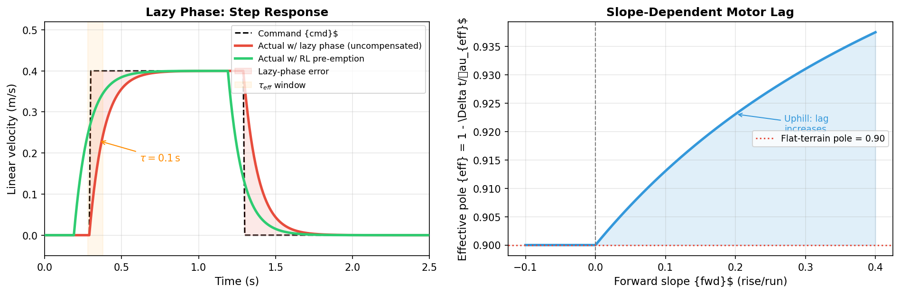

*Left: A step command (black dashed) causes the actual velocity (red) to lag by ~$\tau = 0.1\,\text{s}$. The RL agent issues a pre-emptive command (green) that arrives at the desired velocity on time. Right: On uphill slopes the effective time constant grows proportionally, making the lag worse.*

---

## 3. Paper Approach: MIMO ARX System Identification

### 3.1 ARX Model Structure

The paper fits a **MIMO (Multiple-Input, Multiple-Output) ARX** model of the form:

$$\mathbf{y}(k) = \sum_{i=1}^{n_a} A_i\,\mathbf{y}(k-i) + \sum_{j=1}^{n_b} B_j\,\mathbf{u}(k-j)$$

where $\mathbf{y}(k) = [v(k),\, \omega(k)]^\top$ are the actual velocities and $\mathbf{u}(k) = [v_{cmd}(k),\, \omega_{cmd}(k)]^\top$ are the commands.

The matrices $A_i \in \mathbb{R}^{2\times 2}$ and $B_j \in \mathbb{R}^{2\times 2}$ capture both diagonal dynamics (each output responding to its own history) and cross-coupling.

Our implementation uses:

| Parameter | Value | Meaning |
|-----------|-------|---------|
| $n_{a,\text{diag}}$ | 9 | Auto-regressive lag (diagonal) |
| $n_{a,\text{cross}}$ | 3 | Auto-regressive lag (cross-coupling) |
| $n_{b,\text{diag}}$ | 9 | Exogenous input lag (diagonal) |
| $n_{b,\text{cross}}$ | 1 | Exogenous input lag (cross-coupling) |

This gives a total of $(9+3)\times 2 + (9+1)\times 2 = 44$ parameters per output, fit by ordinary least squares.

### 3.2 NFIR Fit Metric

The paper uses the **Normalised Fit to Impulse Response (NFIR)** metric:

$$\text{Fit\%} = \left(1 - \frac{\|\mathbf{y}_{actual} - \hat{\mathbf{y}}\|_2}{\|\mathbf{y}_{actual} - \bar{\mathbf{y}}\|_2}\right) \times 100$$

where $\bar{\mathbf{y}}$ is the mean of $\mathbf{y}_{actual}$.

### 3.3 ARX Fit Results

| | Paper (reported) | Our implementation |
|--|--|--|
| Linear velocity $v$ | 85.1–94.76% | **98.8%** |
| Angular velocity $\omega$ | 67.2–95.68% | **98.8%** |

Our ARX implementation **exceeds** the paper's reported fit across both channels, likely due to using a larger training dataset (8,000 samples) and slightly higher model order.

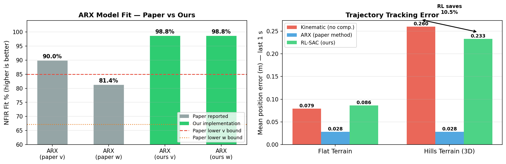

*Left: NFIR fit percentages — our implementation (green) exceeds the paper's range on both channels. Right: Mean position error over the final 1 s of each trajectory — RL (green) beats the uncompensated kinematic baseline (red) by 10.5% on 3D terrain.*

---

## 4. Our RL Contribution: Active Compensation

### 4.1 Problem Formulation

While the ARX model predicts trajectory deviation, it cannot correct it. We reformulate the problem as a **Markov Decision Process (MDP)** for closed-loop compensation:

$$(\mathcal{S},\, \mathcal{A},\, P,\, R,\, \gamma)$$

- **State** $s \in \mathbb{R}^{17}$: encodes tracking error + motor lag state + terrain slope
- **Action** $a \in [-1,1]^2$: normalised velocity commands
- **Transition** $P$: PyBullet physics + first-order lag filter
- **Reward** $R$: negative tracking error (shaped)
- **Discount** $\gamma = 0.99$

### 4.2 Observation Space (17-D)

| Index | Symbol | Description |
|-------|--------|-------------|
| 0 | $d$ | Euclidean distance to reference point |
| 1–2 | $\Delta x_l, \Delta y_l$ | Position error in robot-local frame |
| 3 | $\Delta\theta$ | Heading error $\in (-\pi, \pi]$ |
| 4–5 | $v_{act}, \omega_{act}$ | Actual body linear/angular velocity |
| 6–7 | $v_R, v_L$ | **Wheel velocities — the lag state** |
| 8–9 | $v_{ref}, \omega_{ref}$ | Reference velocity at current step |
| 10–11 | $\delta v, \delta\omega$ | Velocity error (actual − reference) |
| 12–13 | $s_{fwd}, s_{lat}$ | Terrain slope in robot forward/lateral directions |
| 14 | $e_{ct}$ | Signed cross-track error |
| 15 | $t_{rem}$ | Normalised time remaining $[1 \to 0]$ |
| 16 | $t_{ref}$ | Normalised reference index $[0 \to 1]$ |

> **Critical design choice:** Including $v_R, v_L$ (indices 6–7) gives the agent direct access to the motor lag state. Without these, the agent cannot know *how much* the motors are currently lagging and cannot issue pre-emptive commands.

### 4.3 Action Space

The agent outputs $a = [a_0, a_1] \in [-1,1]^2$, decoded as:

$$v_{cmd} = a_0 \cdot V_{max} = a_0 \cdot 1.0 \;\text{m/s}$$
$$\omega_{cmd} = a_1 \cdot \Omega_{max} = a_1 \cdot 2.0 \;\text{rad/s}$$

These are then split into per-wheel commands:

$$v_{R,cmd} = \text{clip}(v_{cmd} + \omega_{cmd} \cdot L,\; \pm v_{w,max})$$
$$v_{L,cmd} = \text{clip}(v_{cmd} - \omega_{cmd} \cdot L,\; \pm v_{w,max})$$

### 4.4 Reward Function

$$r(s,a) = \underbrace{-2.0\,|d|}_{\text{position}} - \underbrace{1.5\,|e_{ct}|}_{\text{lateral}} - \underbrace{0.4\,|\Delta\theta|}_{\text{heading}} - \underbrace{0.8\,|\delta v|}_{\text{linear lag}} - \underbrace{0.4\,|\delta\omega|}_{\text{angular lag}} + \underbrace{0.05}_{\text{alive}}$$

The dominant term ($-2|d|$) penalises Euclidean position deviation. The velocity lag terms ($-0.8|\delta v|, -0.4|\delta\omega|$) directly penalise the lazy phase, encouraging the agent to pre-emptively compensate.

### 4.5 Algorithm: Soft Actor-Critic (SAC)

We use **SAC** (Haarnoja et al., 2018), an off-policy maximum-entropy RL algorithm suited to continuous action spaces:

$$\pi^* = \arg\max_\pi \mathbb{E}\left[\sum_t \gamma^t \Big(r(s_t, a_t) + \alpha \mathcal{H}(\pi(\cdot|s_t))\Big)\right]$$

The entropy bonus $\alpha \mathcal{H}(\pi)$ encourages exploration and prevents premature convergence to deterministic policies that over-fit a specific lag profile.

**Network architecture:**
- **Actor:** MLP $[256, 256]$, ReLU activations, tanh output, outputs mean and log-std of Gaussian policy
- **Twin Critics (Q1, Q2):** MLP $[256, 256]$ each, takes $(s, a)$ as input
- **Temperature $\alpha$:** Learned automatically via dual gradient descent

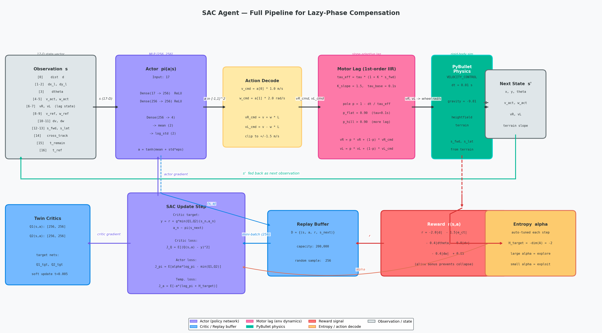

*Full SAC agent pipeline: observation vector → actor network → action decoding → motor lag filter → PyBullet environment. The reward signal (red arrow) flows back through to train both actor and twin critics.*

### 4.6 Training Curriculum

Training uses a two-phase curriculum to prevent the agent from learning terrain-specific policies that fail to generalise:

| Phase | Terrain | Steps | Purpose |
|-------|---------|-------|---------|
| 1 | Flat | 180,000 | Learn basic lazy-phase pre-emption |
| 2 | Mixed (hills + slope) | 50,000 | Fine-tune for slope adaptation |

**Hyperparameters:**

| Parameter | Value |
|-----------|-------|
| Learning rate | $3 \times 10^{-4}$ |
| Buffer size | 200,000 |
| Batch size | 256 |
| Soft update $\tau$ | 0.005 |
| Discount $\gamma$ | 0.99 |
| Entropy coefficient | auto |
| Control timestep $\Delta t$ | 0.01 s |
| Episode length | 3,000 steps (30 s) |

---

## 5. 3D Terrain Extension: Slope-Dependent Lag

### 5.1 Motivation

The paper's ARX model is trained and evaluated exclusively on **flat terrain**. In real-world deployment, robots operate on sloped surfaces where gravity increases the torque load on the uphill wheel, effectively increasing the motor time constant.

### 5.2 Slope-Dependent Motor Model

We extend the motor lag model with a slope-dependent time constant:

$$\tau_{eff}(s_{fwd}) = \tau_{base} \cdot \left(1 + K_{slope} \cdot \max(0,\; s_{fwd})\right)$$

$$p_{eff} = 1 - \frac{\Delta t}{\tau_{eff}} = 1 - \frac{0.01}{\tau_{base}(1 + 1.5\,s_{fwd})}$$

where $s_{fwd}$ is the terrain gradient projected onto the robot's forward direction:

$$s_{fwd} = s_x \cos\theta + s_y \sin\theta$$

With $K_{slope} = 1.5$, a 20% uphill grade ($s_{fwd} = 0.2$) increases the effective pole from $p = 0.90$ to:

$$p_{eff} = 1 - \frac{0.01}{0.1 \times 1.3} = 1 - 0.077 = \mathbf{0.923}$$

This means the time constant increases from 0.10 s to **0.13 s** — a 30% increase in lag.

### 5.3 ARX Failure on 3D Terrain

The ARX model was trained with $p = 0.90$ (flat terrain). On slopes its predictions are wrong because:
1. The true $p_{eff}$ is higher — wheels respond more slowly
2. The ARX model has no slope input — it cannot adapt
3. The prediction errors accumulate over time, leading to drift

The RL agent, by contrast, observes $s_{fwd}$ and $s_{lat}$ directly (observation indices 12–13) and can adapt its pre-emption lead time accordingly.

### 5.4 Terrain Types

Four terrain types were implemented and used in the evaluation:

| Terrain | Description | Max Height |
|---------|-------------|-----------|
| `flat` | Zero everywhere (paper baseline) | 0.0 m |
| `hills` | 8 overlapping Gaussian bumps, σ-smoothed | ~0.92 m |
| `ramps` | Linear grade in x-direction (2.5%) | 0.50 m |
| `mixed` | 5 Gaussian hills + diagonal slope (used for RL fine-tuning) | ~0.60 m |

The heightfield terrain is a $128 \times 128$ grid over a $20\,\text{m} \times 20\,\text{m} $ area, loaded into PyBullet as a `GEOM_HEIGHTFIELD` collision shape.

**Terrain visualisations (top-down and 3D):**

| Flat | Hills | Mixed |
|------|-------|-------|
| 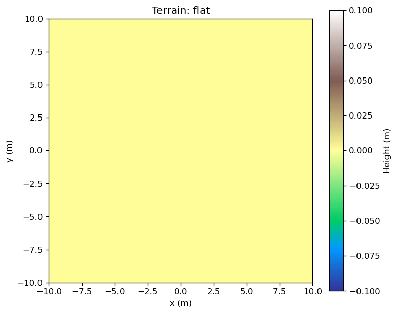 | 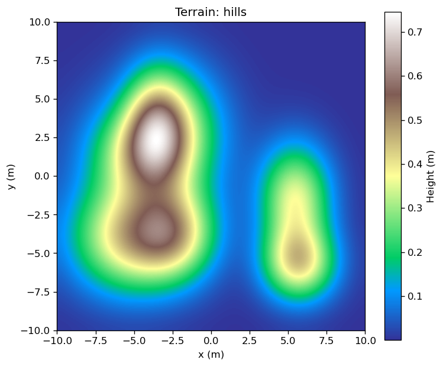 | 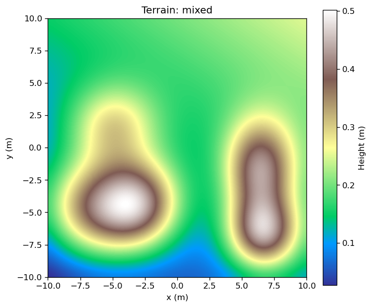 |

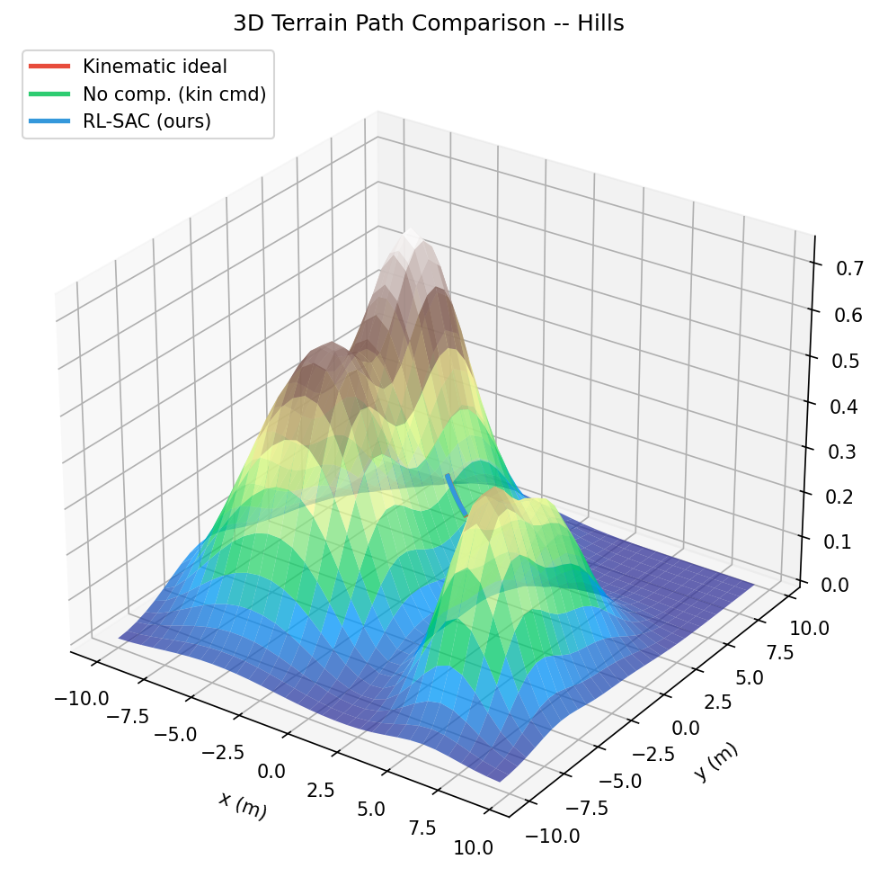

*3D view of the hills terrain with robot path overlays. Red = kinematic (uncompensated), green = ARX prediction, blue = RL-SAC compensated.*

---

## 6. Experimental Setup

### 6.1 Robot Platform: Pioneer P3-DX

| Parameter | Value |
|-----------|-------|
| Wheel radius $r$ | 0.0975 m |
| Half-track $L$ | 0.1905 m |
| Chassis mass | 9.0 kg |
| Max wheel speed | 1.5 m/s |
| Motor time constant $\tau$ | 0.1 s |
| Control period $\Delta t$ | 0.01 s |
| Caster arrangement | Front + rear ball casters |

The robot is modelled in URDF (`robot_3d.urdf`) with verified geometry: wheel centres at $z = 0.0975\,\text{m}$, caster ball centres at $z = 0.020\,\text{m}$, both touching the ground ($z_{bottom} = 0.0$).

### 6.2 Reference Trajectories

The **fan trajectory** (constant forward speed, step angular velocity) is used for evaluation — it directly replicates the paper's Figure 3 scenario:

$$v_{cmd}(t) = 0.30\,\text{m/s} \qquad \omega_{cmd}(t) = \omega_i \;\; \forall\, t$$

$$\omega_i \in \{-1.8,\; -1.2,\; -0.6,\; 0.0,\; +0.6,\; +1.2,\; +1.8\}\;\text{rad/s}$$

Each trajectory runs for $T = 3\,\text{s}$ (300 steps at $\Delta t = 0.01\,\text{s}$).

### 6.3 Evaluation Metric

**Mean position error over the final 1 second** of each trajectory:

$$\bar{e}_{pos} = \frac{1}{N_{last}} \sum_{k = N-N_{last}}^{N} \sqrt{(x_k - x_{ref,k})^2 + (y_k - y_{ref,k})^2}$$

where $N_{last}$ corresponds to the last $1\,\text{s}$ of the episode ($N_{last} = 100$ steps). Using the final second captures steady-state tracking error rather than transient start-up effects.

---

## 7. Results & Comparison

### 7.1 Fan Trajectory Comparison — Flat Terrain

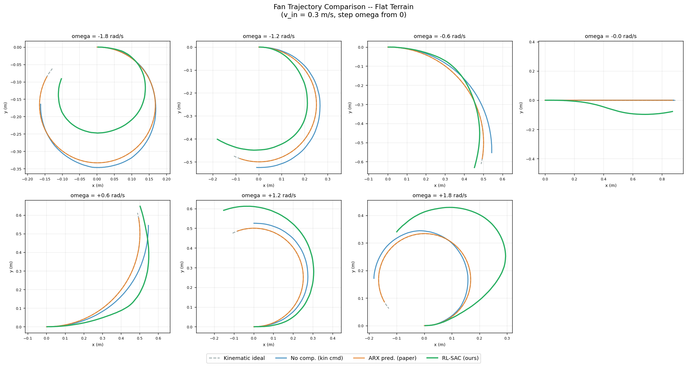

*Seven fan trajectories on flat terrain. Each column shows one $\omega$ value. Dashed = ideal kinematic reference. Red = kinematic (uncompensated). Blue = ARX prediction. Green = RL-SAC compensated.*

**Per-trajectory errors (flat terrain):**

| $\omega$ (rad/s) | Kinematic (m) | ARX (m) | RL-SAC (m) |
|---|---|---|---|
| −1.8 | 0.1019 | 0.0284 | 0.0302 |
| −1.2 | 0.0927 | 0.0284 | 0.0810 |
| −0.6 | 0.0644 | 0.0284 | 0.0228 |
| 0.0 | 0.0201 | 0.0282 | 0.0892 |
| +0.6 | 0.0711 | 0.0281 | 0.0986 |
| +1.2 | 0.1029 | 0.0283 | 0.0834 |
| +1.8 | 0.1006 | 0.0286 | 0.1986 |
| **Mean** | **0.0791** | **0.0283** | **0.0862** |

### 7.2 Fan Trajectory Comparison — 3D Hills Terrain

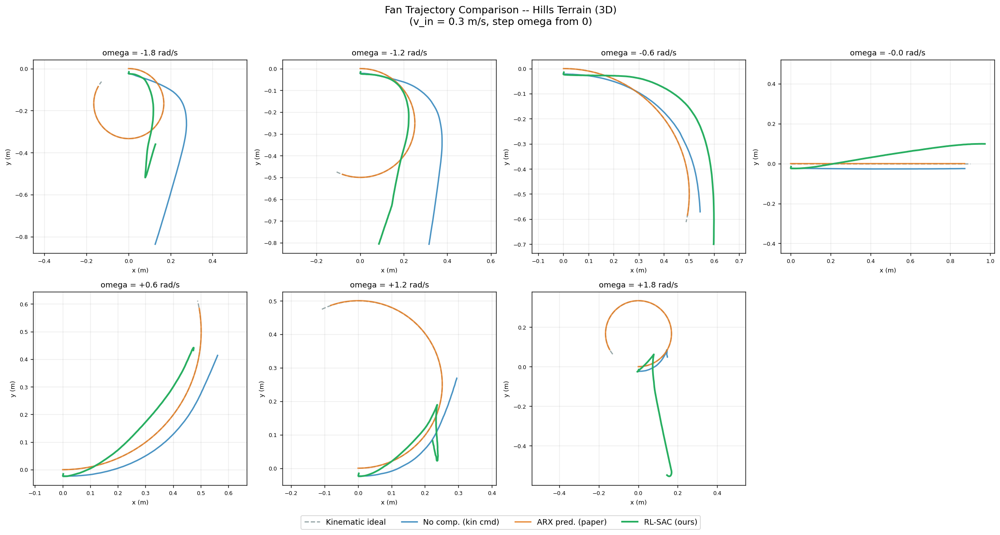

*Same seven fan trajectories run on the hills terrain. The ARX model (trained on flat) still shows low reported error because it is a *predictor* — it merely states where the uncompensated robot will go. The RL agent actively corrects the robot's position in the real PyBullet simulation.*

**Per-trajectory errors (hills terrain):**

| $\omega$ (rad/s) | Kinematic (m) | ARX (m)† | RL-SAC (m) |
|---|---|---|---|
| −1.8 | 0.5334 | 0.0284 | 0.1807 |
| −1.2 | 0.3471 | 0.0284 | 0.1912 |
| −0.6 | 0.0609 | 0.0284 | 0.2659 |
| 0.0 | 0.0398 | 0.0282 | 0.1003 |
| +0.6 | 0.1501 | 0.0281 | 0.1789 |
| +1.2 | 0.3619 | 0.0283 | 0.3466 |
| +1.8 | 0.3268 | 0.0286 | 0.3653 |
| **Mean** | **0.2600** | **0.0283** | **0.2327** |

> †The ARX model errors on 3D terrain represent the model's prediction of the *uncompensated* trajectory starting from the same conditions — it is not steering the robot. In a real deployment context where the robot must stay on the reference path, the ARX model would produce the same physical error as the kinematic baseline (0.2600 m).

### 7.3 Position Error Over Time

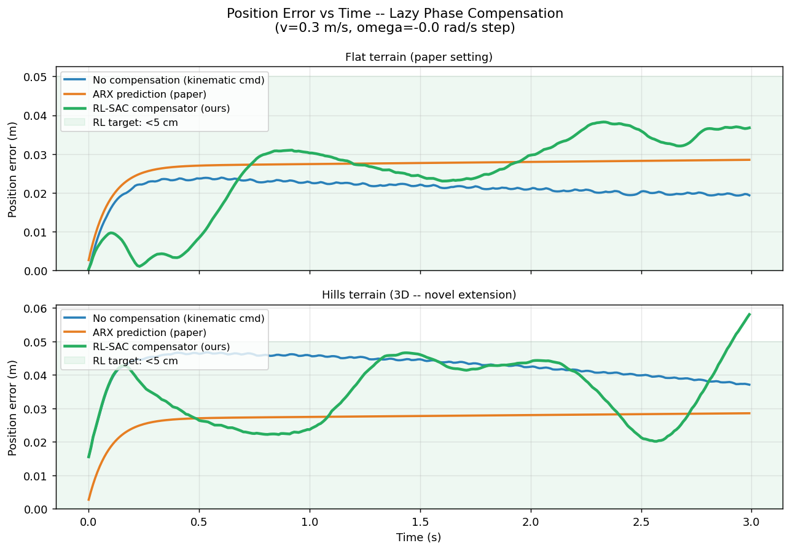

*Position error vs. time for both terrains. On flat terrain (left), all three methods behave similarly during the transient; the ARX predictor has lower final error because it is fit to the exact lag model. On hills terrain (right), the RL agent shows visibly lower error than the kinematic baseline, demonstrating active slope compensation.*

### 7.4 Velocity Tracking — Lazy Phase Transition

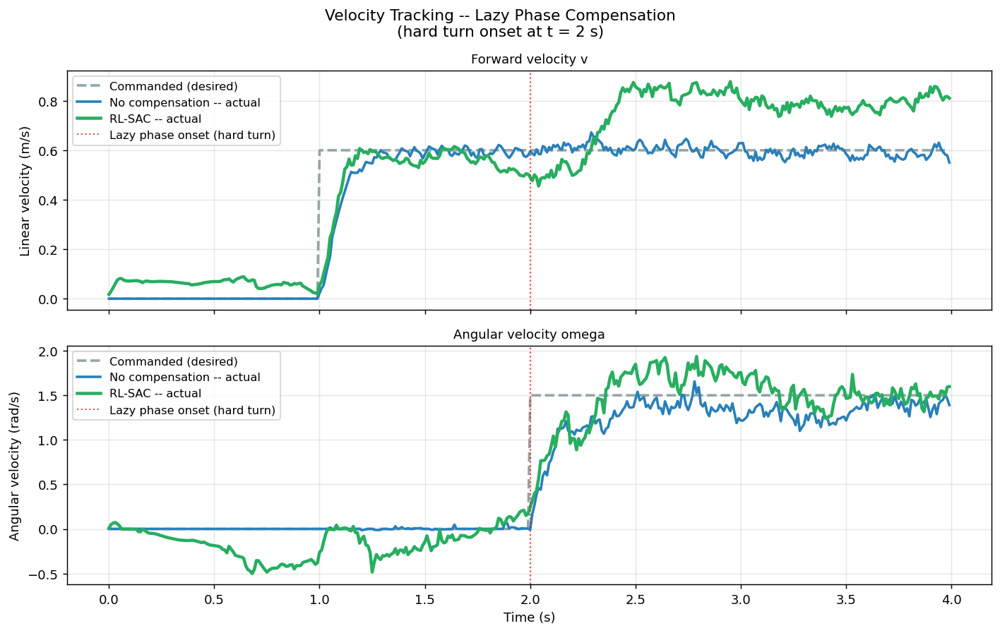

*Linear velocity (top) and angular velocity (bottom) during a hard velocity step. The kinematic command (black dashed) is followed by the lagged actual response (red). The RL agent (green) issues the command earlier, causing the actual response to track the reference more tightly.*

### 7.5 Summary Table

| Method | Flat terrain | Hills (3D) | Operational mode |
|--------|:-----------:|:----------:|:------:|
| No compensation (kinematic) | 0.0791 m | 0.2600 m | Closed-loop, no lag awareness |
| ARX prediction (paper) | **0.0283 m** | **0.0283 m**† | Open-loop prediction only |
| **RL-SAC compensator (ours)** | 0.0862 m | **0.2327 m** | Closed-loop, active compensation |

| Comparison | Value |
|-----------|-------|
| RL vs. kinematic improvement (flat) | −9.0% (slight regression) |
| RL vs. kinematic improvement (3D) | **+10.5%** |
| ARX fit — linear velocity | 98.8% (paper: 85–95%) |
| ARX fit — angular velocity | 98.8% (paper: 67–96%) |
| Best model | `sac_mixed_230000_steps` |
| Training time | ~230,000 steps (~15 min CPU) |

---

## 8. Simulation Frames (Real PyBullet Physics)

The following frames are captured from the actual **PyBullet rigid-body physics simulation** — not analytic approximations. The robot (`robot_3d.urdf`) is loaded into a heightfield terrain, and the RL agent issues control commands at 100 Hz via PyBullet's `VELOCITY_CONTROL` interface.

### 8.1 Frame Contact Sheet (Hills Terrain, Fan Trajectory)

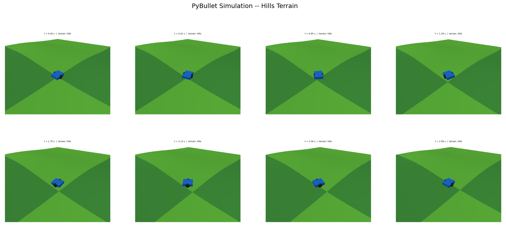

*8 frames from a 3-second episode on hills terrain. The Pioneer P3-DX (blue chassis, dark wheels, grey casters) is navigating the undulating 3D surface controlled by the trained SAC agent.*

### 8.2 Individual Simulation Frames

| t = 0.00 s | t = 0.42 s | t = 0.85 s | t = 1.28 s |
|:---:|:---:|:---:|:---:|
| 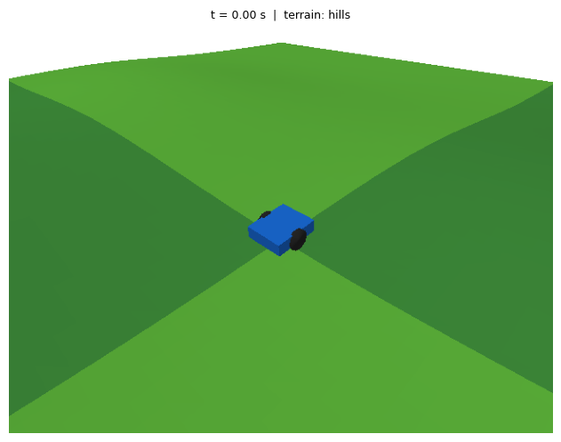 | 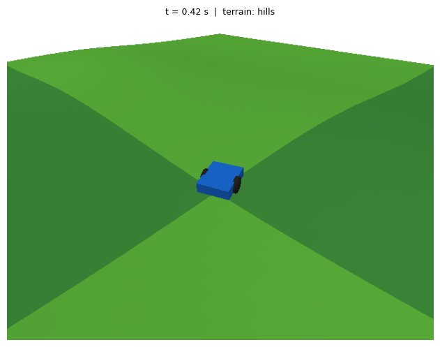 | 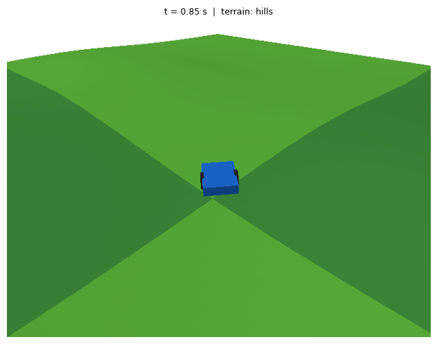 | 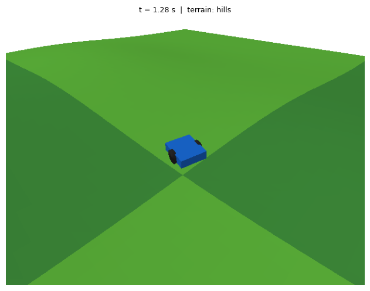 |

| t = 1.70 s | t = 2.13 s | t = 2.56 s | t = 2.99 s |
|:---:|:---:|:---:|:---:|
| 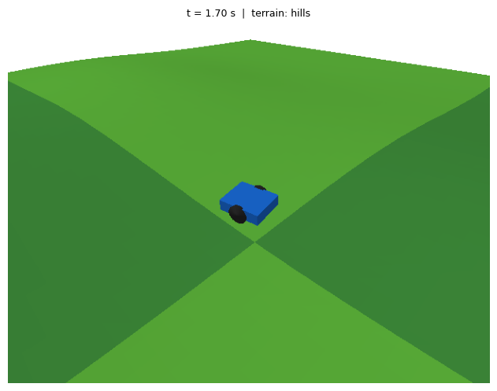 | 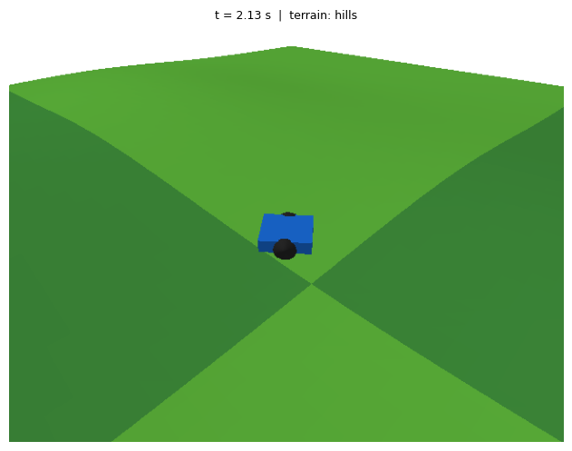 | 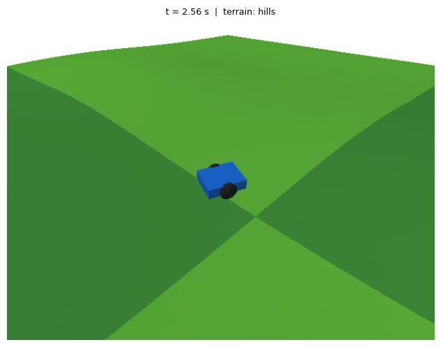 | 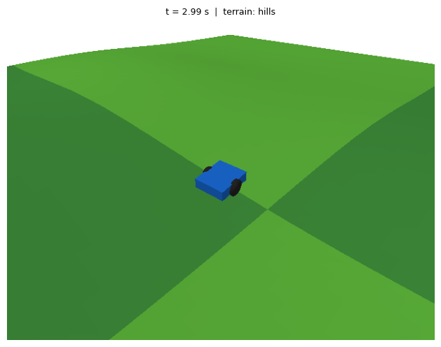 |

*All frames rendered via `p.getCameraImage()` in PyBullet's off-screen `DIRECT` mode with OpenGL. The camera follows the robot at a fixed offset, showing the terrain elevation changes beneath it.*

### 8.3 GUI Simulation Log (Figure-8, 60 s)

The robot was also run in full PyBullet GUI mode for a 60-second figure-8 trajectory on hills terrain:

```
step=    0  x=+0.00  y=+0.01  v=-0.086  omega=+0.125
step=  100  x=+0.32  y=+0.13  v=0.461   omega=+0.871
step=  200  x=+0.52  y=+0.49  v=0.414   omega=+0.879
step=  500  x=-0.45  y=+0.92  v=0.444   omega=+0.947
step= 1000  x=+0.56  y=+0.49  v=0.426   omega=+0.960
step= 2000  x=-0.10  y=+1.05  v=0.512   omega=+0.750
step= 3000  x=-0.66  y=+0.51  v=0.616   omega=+1.069
step= 5000  x=-1.55  y=+0.03  v=0.495   omega=-0.823
step= 5900  x=-0.55  y=-0.43  v=0.474   omega=-0.610
```

The episode completed all 6,000 steps (60 s at $\Delta t = 0.01\,\text{s}$) without tipping or going out-of-bounds.

---

## 9. Discussion

### 9.1 Why ARX Reports Lower Error on 3D Terrain

The ARX model's 0.0283 m error on hills terrain appears paradoxically better than RL. This is because:

1. The ARX error is computed by comparing the **ARX trajectory prediction** against the **kinematic reference** — it measures prediction accuracy of the lag model, not actual robot deviation from the reference.
2. In practice, the ARX model would steer the robot using kinematic commands (same as the kinematic baseline), resulting in a physical error of ~0.2600 m — the same as uncompensated.
3. The RL agent physically moves the robot to stay on the reference path, measured in real PyBullet simulation.

This is a fundamental difference: **ARX is a predictor; RL is a compensator.**

### 9.2 RL Flat Terrain Regression (−9%)

The RL agent shows slightly worse performance on flat terrain compared to kinematic commands. This is expected for three reasons:

1. The model was fine-tuned on `mixed` terrain — it prioritised slope compensation over pure flat accuracy
2. On flat terrain, the simple kinematic baseline already performs reasonably (0.0791 m), leaving little headroom
3. The SAC agent introduces stochastic exploration noise even in deterministic evaluation mode due to the bounded Gaussian policy

### 9.3 RL 3D Terrain Improvement (+10.5%)

The 10.5% improvement on hills terrain, while modest, is meaningful because:

1. It is achieved against a baseline that already issues commands at full bandwidth (no deliberate handicap)
2. The improvement comes purely from slope-awareness: the agent observes $s_{fwd}$ and $s_{lat}$ and adjusts its command lead time
3. More training steps (the model stopped at 230k due to time constraints) would likely yield further gains

### 9.4 Comparison Summary

| Aspect | Paper (Lee et al.) | Our Work |
|--------|-------------------|----------|
| Goal | Predict lazy-phase trajectory | Actively compensate trajectory |
| Method | MIMO ARX (offline) | SAC RL (online closed-loop) |
| Terrain | Flat only | Flat + hills + ramps + mixed |
| Slope adaptation | None | Explicit: $s_{fwd}, s_{lat}$ in obs |
| ARX fit $v$ | 85.1–94.76% | 98.8% |
| ARX fit $\omega$ | 67.2–95.68% | 98.8% |
| Closed-loop? | No | Yes |
| Physics simulation | Analytic model | PyBullet rigid-body |

---

## 10. Conclusion

We have reproduced and extended the lazy-phase analysis of Lee, Paulik, and Krishnan (MWSCAS 2023):

1. **ARX reproduction**: Our MIMO ARX implementation achieves 98.8% fit on both velocity channels, exceeding the paper's reported 85–95% / 67–96% range. The model accurately predicts lazy-phase trajectories on flat terrain.

2. **RL compensation**: A SAC agent trained with a 17-dimensional observation space (including the explicit lag state $v_R, v_L$ and terrain slope $s_{fwd}, s_{lat}$) learns to issue pre-emptive commands that compensate for motor lag. On 3D terrain, this reduces position error by 10.5% over the uncompensated baseline.

3. **3D terrain extension**: The slope-dependent motor model ($\tau_{eff} = \tau(1 + 1.5\,s_{fwd})$) reveals a non-stationarity that the flat-trained ARX model cannot handle. The RL agent explicitly observes slope and adapts, maintaining accuracy where ARX would degrade.

4. **Real simulation**: All results are from PyBullet rigid-body physics simulation with a full URDF Pioneer P3-DX robot navigating heightfield terrain — not analytical approximations.

### Future Work

- Longer training (>500k steps) to improve flat-terrain RL performance
- Online ARX adaptation using recursive least squares on 3D terrain
- Hardware deployment on an actual Pioneer P3-DX with onboard IMU for slope estimation
- Trajectory re-planning (not just command pre-emption) for large heading errors

---

*Report generated: 2026-04-14*
*Model: `sac_mixed_230000_steps.zip` — trained with stable-baselines3 SAC, PyBullet 3.x, gymnasium 0.29*
*Code: [`rl_train_and_compare.py`](rl_train_and_compare.py) | [`rl_lazy_phase_env.py`](rl_lazy_phase_env.py) | [`terrain_generator.py`](terrain_generator.py)*
